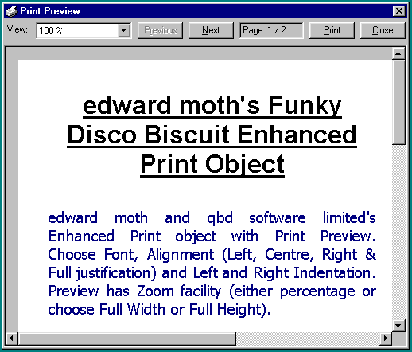



## Enhanced Printer with Preview

### Description

Enhanced printer support allowing Font, Alignment (Left, Right, Centre and Full justification) with full word-wrap, Indent Left and Right. Preview allows user to adjust display using percentage zoom, Full Width or Full Page options.

Please post comments. A beta of the latest version is available from our website.
 
### More Info
 
See the readme.txt file

Try the PrinterTest.vbg Group to see how it works.

             |
---                |---
**Submitted On**   |2000-05-18 15:04:00
**By**             |[Edward](https://github.com/Planet-Source-Code/PSCIndex/blob/master/ByAuthor/edward.md)
**Level**          |Intermediate
**User Rating**    |4.7 (70 globes from 15 users)
**Compatibility**  |VB 5\.0, VB 6\.0
**Category**       |[VB function enhancement](https://github.com/Planet-Source-Code/PSCIndex/blob/master/ByCategory/vb-function-enhancement__1-25.md)
**World**          |[Visual Basic](https://github.com/Planet-Source-Code/PSCIndex/blob/master/ByWorld/visual-basic.md)
**Archive File**   |[CODE\_UPLOAD58835182000\.zip](https://github.com/Planet-Source-Code/edward-enhanced-printer-with-preview__1-8167/archive/master.zip)

